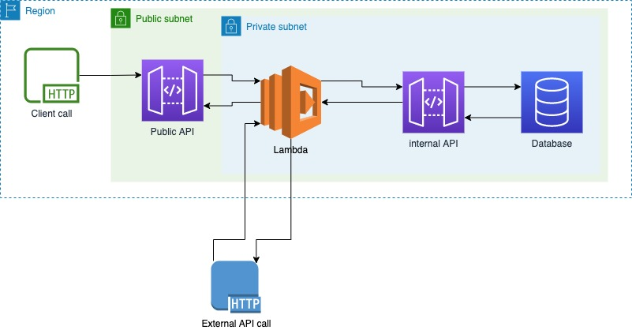

# TourRadar

## Senior Software Engineer Test Case: Fintech

This test case consists of 3 parts:

- [The architecture challenge](#the-architecture-challenge)
- [The coding challenge](#the-coding-challenge)
- [Writing tests](#writing-tests)

**Each section is designed to spend no more than 4 hours on it.**

## Glossary

Before you start, we want to make sure you understand the abbreviations used, and created a small glossary for you:

- SQS - [Amazon Simple Queue Service](https://aws.amazon.com/sqs/)
-
DLQ - [Amazon SQS dead-letter queues](https://docs.aws.amazon.com/AWSSimpleQueueService/latest/SQSDeveloperGuide/sqs-dead-letter-queues.html)
- CLI command - [Command line interface command](https://en.wikipedia.org/wiki/Command-line_interface)

## The Architecture challenge



We have an issue related to our application load because of huge amount of HTTP requests it receives. Those requests
could be potentially processed asynchronously, as the client doesn't care about the response from our API gateway
endpoint. Having that in mind, we decided to improve our application architecture by integrating an SQS queue into the
current system.
You need to help us to build a new AWS architecture design, where we will have an SQS queue for collecting the requests,
and a PHP application for consuming the messages from that queue. The queue should be called `finance-queue-production`.
We need to make sure the application is consuming messages correctly and keeps track of errors. Sometimes there might be
a timeout and then, after 1 minute, the same request would work again. Please write down a way of handling such cases.

From the consumer perspective, you should expect calls to the **external API**
`GET https://some-external-api.com/api/booking/{booking_id}` and to our internal API
`POST https://some-internal-api.internal/api/booking/{booking_id}`.
The architecture should be resilient and performant.

Please, provide the architecture design as a diagram. You can include the image directly, or a shareable link to
diagrams.net or other preferred service.

### Bonus points:

It will be great, if you could share what potential problems you could identify in our presented architecture, and how
you would improve it.

## The coding challenge

### Introduction

We prepared a docker-compose configuration, which you can use during your development. Once you will trigger the
`docker-compose up` command, the following services should be started:

- `finance_task` (REST API)
- `finance_task_sqs` (Fake SQS)

#### REST API

This is the internal API that we use to manage the booking details. The API is available at the address
`http://127.0.0.1:8080`, and has the following endpoints:

- `GET http://127.0.0.1:8080/api/booking/{booking_id}` - used for fetching booking information. The successful output is
  a booking object, and status code is 200. If the booking doesn't exist, the status code will be 404.
- `POST http://127.0.0.1:8080/api/booking/{booking_id}` - used for triggering of the booking event. The successful
  output is an empty object, and status code is 201. If the booking doesn't exist, the status code will be 404. If you
  have validation errors, the status code will be 422. As a special case, if the booking ID is equal to 2, then the
  status code will be 500 (Internal Server Error).

#### Fake SQS

A mock implementation containing critical features of Amazon SQS to aid in local testing.
See more detail on the project page on [Github](https://github.com/iain/fake_sqs).

The list of queues can be found here: `storage/docker/sqs/database.yml`.
If you need to create a new SQS queue, you can use the following command:

```shell
curl http://127.0.0.1:4568 -d "Action=CreateQueue&QueueName=${QUEUE_NAME}&AWSAccessKeyId=accesskeyid" &> /dev/null
```

To send a message to the queue, you can use the following command:

```shell
curl http://127.0.0.1:4568 -d "Action=SendMessage&QueueUrl=${QUEUE_NAME}&MessageBody=testing123&AWSAccessKeyId=accesskeyid"
```

Where `QUEUE_NAME` is the name of your SQS queue.

### Project structure

- `app/Console/Commands` - our consumer CLI command is already there: `ConsumerCommand.php`. You can trigger it by using
  the following command: `php artisan consumer:run`.
- `app/Providers` - path where you need to define the providers.
- `app/Services` - path where you should write the message consumer.

### The assignment

As part of the coding challenge, you need to write a consumer which will consume messages from the
`finance-queue-production` queue.
Each **SQS message** will contain the following message payload in json body:

- `booking_id`: the ID of the booking
- `event`: the type of event

For each message you should do the following:

- fetch booking information from the `GET https://some-external-api.com/api/booking/{booking_id}` endpoint.
- if booking information are received from the external source, you should call our internal API:
  `POST http://some-internal-api.internal/api/booking/{booking_id}` with the following JSON body:
  ``{"event": EVENT_TYPE}``, where `EVENT_TYPE` should contain the value from the `event` attribute in the SQS queue
  message.
- delete the message from the SQS queue.

In case of failure, make sure you handle it appropriately, to be able to track it in the future and not have leftover
messages.

How do you make sure messages are processed in the right order, and only once?

### Instructions to build the solution

There are few rules you should be aware of, before you start working on the task.

1. Uncomment our `ConsumerCommand` in `app/Console/Kernel.php` class, to make sure our command will become visible for
   artisan script.
2. Under the path `app/Services`, please create two services. One should implement `ProcessorInterface` interface, and
   the other should implement the `SqsServiceInterface` interface.
3. Define your services in the `app/Providers/ConsumerProvider.php` service provider, so your consumer command will be
   able to use them.

## Writing tests

For the finance team, it is a requirement to have all your code covered by tests. As you can see, unfortunately our
project doesn't have yet full test coverage. Help us to improve the coverage by adding unit tests!

We follow the standard of writing tests under the `tests/Unit` folder, using the same path of the source file. If you
want to test the functions of a file named `app/Path/To/File.php`, then you need to create a file
`tests/units/Path/To/FileTest.php`.
Make sure you cover all public methods, and consider matching a 90% lines of code coverage. If you think it's not
possible to reach it, please explain why.

To check the test coverage, you can run `composer phpunit:test:coverage:html` or `composer phpunit:test:coverage`.


## Solution Submission

### Architecture Design

### Key Decisions

- SQS decouples incoming requests from booking processing and absorbs traffic spikes.
- PHP consumers process messages asynchronously and can scale horizontally.
- Transient failures are retried through SQS redelivery after the visibility timeout.
- Repeated failures are moved to a DLQ. CloudWatch provides the queue metrics, which are monitored and alerted on through Grafana.
- Configuration values shown in the diagram are proposed starting values.
- A message is only deleted after both API calls succeed.
- If the failure is permanent, like a 404 (the booking doesn't exist), the message is deleted right away instead — retrying it would never fix a booking that doesn't exist.

#### Bonus — Existing Architecture

Potential issues identified:

- Right now everything happens in one request. Client has to wait for the external API call and then the internal API call.
- If traffic spikes suddenly, it goes directly to the APIs. Nothing to absorb it.
- If a call fails or times out, nothing retries automatically. Only retries if client tries again.
- If client retries after a failure, same booking event can get processed twice. Risky for a financial system, could mean same charge happening more than once.

SQS fixes the first three. It does not fix duplicate processing by itself, SQS can still deliver same message twice sometimes. That is fixed separately, by giving each message its own ID and internal API skipping anything already seen.