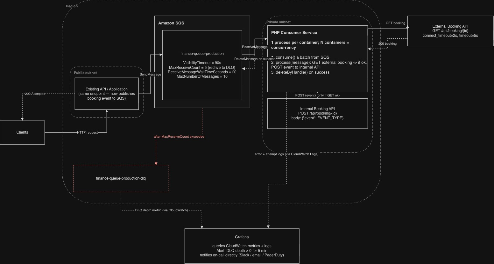

# Booking Event Processor

An asynchronous booking event processor built with PHP and Amazon SQS.

## Architecture Design



## Key Decisions

-   SQS decouples incoming requests from booking processing and absorbs
    traffic spikes.
-   PHP consumers process messages asynchronously and can scale
    horizontally.
-   Transient failures are retried through SQS redelivery after the
    visibility timeout.
-   Repeated failures are moved to a DLQ. CloudWatch provides the queue
    metrics, which are monitored and alerted on through Grafana.
-   Configuration values shown in the diagram are proposed starting
    values.
-   A message is only deleted after both API calls succeed.
-   If the failure is permanent, like a 404 (the booking doesn't exist),
    the message is deleted right away instead --- retrying it would
    never fix a booking that doesn't exist.
-   SQS can deliver the same message more than once, so duplicate
    processing should be handled separately, for example by assigning
    each message a unique ID and having the receiving service ignore IDs
    it has already processed.
-   For cases where events for the same booking must be processed in
    order, an SQS FIFO queue can be used with the booking ID as the
    `MessageGroupId`. This keeps events for each booking ordered while
    allowing different bookings to be processed in parallel.

## Implementation

The implementation is split into two main services:

-   `SqsService` handles receiving messages from SQS and deleting
    processed messages.
-   `Processor` validates each message, retrieves the booking from the
    external API, sends the event to the internal API, and decides
    whether the message should be deleted or left for redelivery.

The AWS SDK is constrained to a pre-JSON-protocol version because the
provided Fake SQS service expects the legacy SQS Query protocol.

Messages are deleted after successful processing. Permanent failures,
such as invalid messages or a missing booking, are also deleted because
retrying would not resolve them. Temporary failures, such as API
timeouts or server errors, are left in the queue and become available
again after the visibility timeout.

### Running the Consumer

The SQS endpoint is configured using the Docker service hostname
`finance_task_sqs`, so run the consumer within the application
container:

``` bash
docker compose exec finance_task php artisan consumer:run
```

## Tests

Unit tests cover the main consumer scenarios, including successful
message processing, malformed messages, API failures and timeouts, SQS
deletion failures, and unexpected exceptions.

The current implementation achieves 100% class, method, and line
coverage for the covered application code.

Run all tests:

``` bash
composer phpunit:test
```

Run tests with coverage:

``` bash
composer phpunit:test:coverage
```

Generate the HTML coverage report:

``` bash
composer phpunit:test:coverage:html
```

The HTML coverage report is generated at:

``` text
test-reports/coverage-html/index.html
```

## Manual Testing

The consumer flow was also verified manually using the provided Fake SQS
environment.

### 1. Start the environment

``` bash
docker compose up -d
```

### 2. Send test messages to SQS

#### Successful processing

``` bash
curl http://127.0.0.1:4568 \
  -d 'Action=SendMessage' \
  -d 'QueueUrl=finance-queue-production' \
  -d 'MessageBody={"booking_id":1,"event":"booking.created"}' \
  -d 'AWSAccessKeyId=accesskeyid'
```

#### Retryable failure

``` bash
curl http://127.0.0.1:4568 \
  -d 'Action=SendMessage' \
  -d 'QueueUrl=finance-queue-production' \
  -d 'MessageBody={"booking_id":2,"event":"booking.created"}' \
  -d 'AWSAccessKeyId=accesskeyid'
```

### 3. Run the consumer

The application consumer command is:

``` bash
php artisan consumer:run
```

When using the provided Docker environment, run the command inside the
application container:

``` bash
docker compose exec finance_task php artisan consumer:run
```

### 4. Verify the result

Two scenarios were verified:

-   **`booking_id: 1` --- successful processing**
    -   External API → `200`
    -   Internal API → `201`
    -   SQS message → deleted after successful processing
-   **`booking_id: 2` --- retryable failure**
    -   External API → `200`
    -   Internal API → `500`
    -   SQS message → not deleted and left for redelivery

### Result

The logs below demonstrate both flows: a successfully processed message
is deleted, while a message that encounters a transient `500` failure is
not deleted and becomes available for redelivery after the SQS
visibility timeout.


